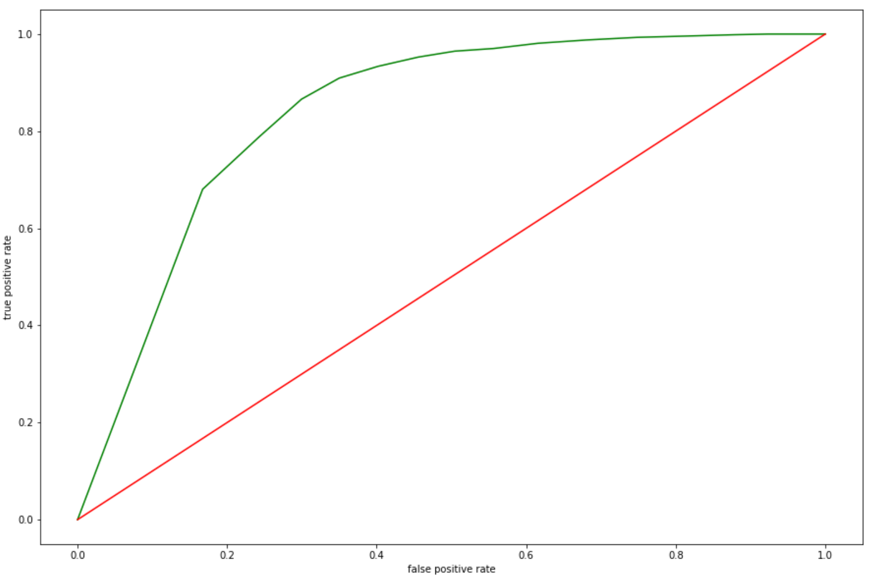

# face_recognition
	1) Used InceptionResnetV1 model with triplet loss
	2) Initialized model weights with different model trained on caspia-webface dataset 

          

# How to setup
	1) clone this directory
	2) install dependencies from requirements.txt
	3) download pretrained model from above link
	4) unzip the file in the main project folder

# Testing for two Images
	1) Perform the setup above
	2) run following command:
		$python3 test.py --image_path <image_path_1> <image_path_2>
	3) If you want to test on gpu use
		$python3 test.py --gpu --image_path <image_path_1> <image_path_2>

# Training
	1) Perform the setup above
	2) Download and unzip the training data in a folder named "trainset" inside main project folder
	3) run the following command:
		$python3 face-detection.py
	4) after that run the following command for fresh training
		$python3 train.py
	5) or run the following command for resuming the training
		$python3 train.py --checkpoint --weight_path <checkpoint> 

# Benchmarking
	1) Perform the setup above
	2) Download and unzip the training data in a folder named "trainset" inside main project folder
	3) run the following command:
		$python3 face-detection.py
	4) run the following command:
		$python3 test.py --gpu --benchmark --model_path <model path>

Performance on validation data(green is trained model)

